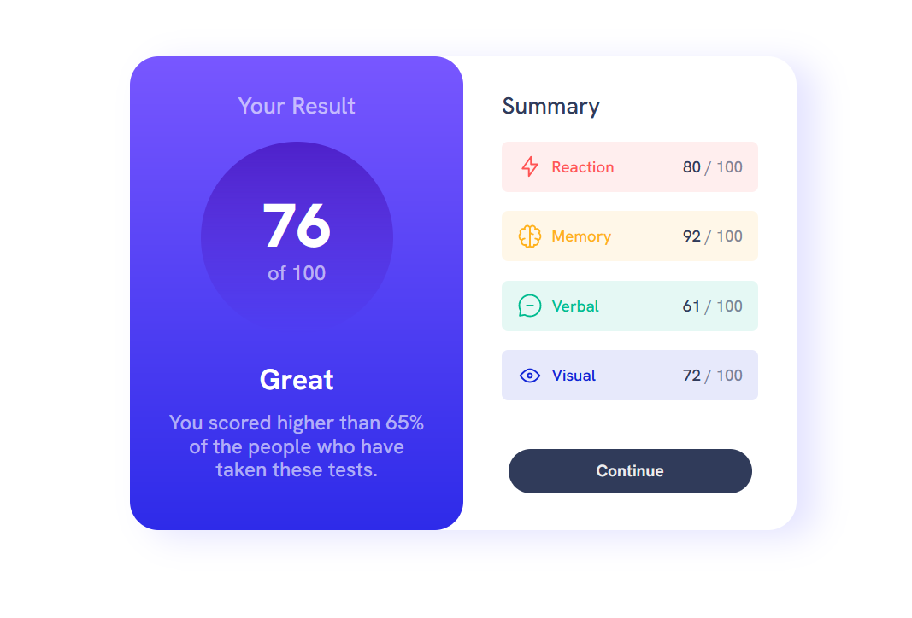
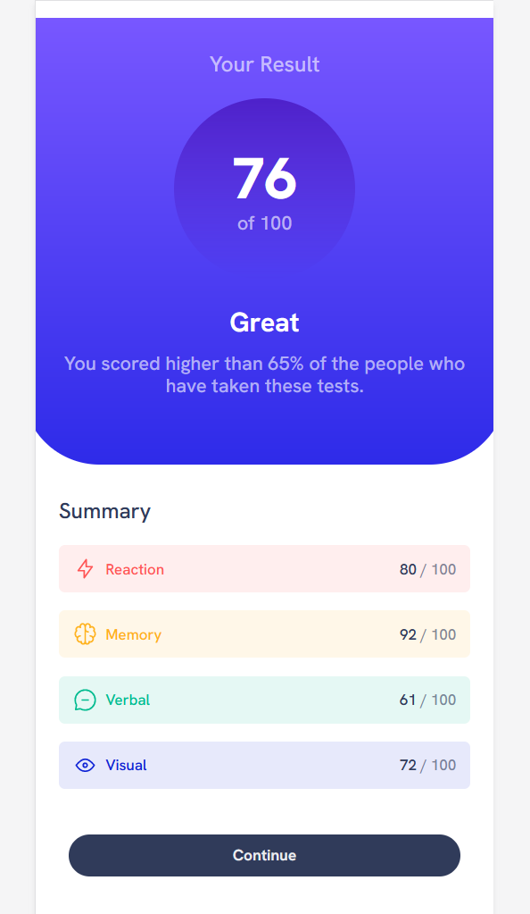

# Responsive Result Summary Component

This is a solution to the [Result Summary Component challenge on Frontend Mentor](https://www.frontendmentor.io/challenges/results-summary-component-CE_K6s0maV)

## Table of contents

- [Overview](#overview)
  - [The challenge](#the-challenge)
  - [Screenshot](#screenshot)
  - [Links](#links)
- [My process](#my-process)
  - [Built with](#built-with)
- [Author](#author)

## Overview

### The challenge

Users should be able to:

- View the optimal layout depending on their device's screen size
- See hover and focus states for interactive elements

### Screenshots

 ### Regular 

 ### Responsive

### Links

- Solution URL: [Responsive Result Summary Component Solution](https://www.frontendmentor.io/solutions/responsive-result-summary-component-sGI_siR-8R)
- Live Site URL: [Responsive Result Summary Component Live Site](https://isaacfleurivil.github.io/results-summary-component-main/)

## My process

### Built with

- Flexbox
- CSS Grid

## Author

- Frontend Mentor - [@IsaacFleurivil](https://www.frontendmentor.io/profile/isaacfleurivil)

